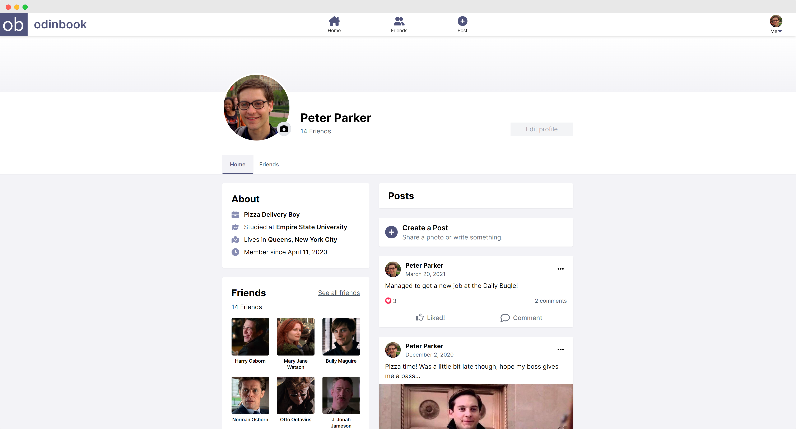

# Odinbook frontend
This is the frontend repository for [odinbook](https://odinbook-dm.herokuapp.com/) - a social media website created as part of [The Odin Project](https://www.theodinproject.com/) NodeJS course. This repository contains all the client-side code for odinbook, with information on the features and technologies used. For a general overview of odinbook, or detailed information on the backend, please visit the following links:

Visit the [backend repository »](https://github.com/daniel-moderiano/odinbook-backend)

Visit the [parent repository »](https://github.com/daniel-moderiano/odinbook)

## About the project

The odinbook frontend is an ReactJS single page application that interfaces with odinbook backend API to provide a polished social media website. This frontend application is served by the odinbook backend, hosted on [Heroku](https://www.heroku.com/). The entire frontend design has been done with Tailwind CSS, and is inspired by the likes of Facebook and LinkedIn. 

### Features

* **Clean, complete design:** every feature of the frontend has been designed with consistency and good user experience in mind. This includes graceful error handling, unobstrusive notifications, and custom skeleton loaders. This all comes fully resopnsive as well.
* **Focus on accessiblity:** the entire frontend has been reviewed to maximise accessibility, including AI generated alt-text for user-uploaded images, custom keyboard navigation for menus, and visually appropriate UI/UX design.
* **Test-driven development:** using the Jest testing framework, there is considerable code coverage with tests, and the application was developed with test-driven development principles as much as possible.

### Technologies used

At it's core, the odinbook backend is a NodeJS/Express application with MongoDB for data storage. Other major third party APIs are also listed here.

* [React](https://reactjs.org/) - Frontend JavaScript framework
* [Tailwind CSS](https://tailwindcss.com/) - CSS framework
* [Jest](https://jestjs.io/) - JavaScript testing framework

## Acknowledgments

The following resources were a great help throughout the development of the odinbook frontend.

* [Traversy Media](https://www.youtube.com/channel/UC29ju8bIPH5as8OGnQzwJyA) for general MERN stack advice
